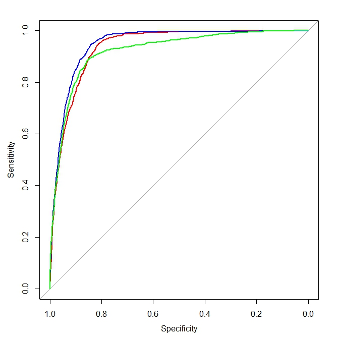

#Approach
* Check the integrity of the data and clean the data if necessary.  
* Perform a naive analysis on the dataset as the baseline.  
* The Linear Regression model will be used for initial analysis.  
* Random Forest and SVM will also be used for comparison.  
* Choose the optimal algorithm and include the model as well as the scoring function in the format of an R package.  
   
  
#Data Cleaning  
The data is really clean.  All columns contains consistent data. No spelling errors and no missing values in any fields.  The only column we have taken out is the poutcome column which contains the same information as the outcome column 'y.'  
  
  
#Naive Analysis -- The Age Group Assumption  
We assume the effectiveness of the campaign is somehow related to the age of the clients and we look at the number of success each age group generated in the past campaign, we can see the deposit distribution in the figure below:  
  
```{r echo=FALSE}
setwd("GitHub/CSX415-project")
mydata <- read.csv(file="bankingclientsprofile/data/updatedbankingdata.csv", header=TRUE, check.names=FALSE, sep=",")
hist(mydata$age[mydata$y=="yes"], main="Campaign Success by Age", xlab='Age', ylab='Deposits', col='lightyellow2')
q<-quantile(mydata$age, c(0.25,0.75))
abline(v=q[1],col='blue', lwd=2)
abline(v=q[2],col='blue', lwd=2)

```
  
As we can see from the graph, the middle of the age group yields most deposits.  A simple solution will be for the campaign team to focus on the middle 50 percentile of the client base and call the remaining later. The deposits will be generated during the busy season would be:  
  
`r nrow(mydata[mydata$y=="yes" & mydata$age>=q[1] & mydata$age<=q[2],])`  

The total number of deposites generated if half the clients were randomly called would be:   
`r nrow(mydata[mydata$y=="yes",])/2`  
  
This approach is less effective than the randomly picked clients.  Therefore, this age group model is not a good model.    
  

#Simple Analysis -- Linear Regression  
Next, we will train the linear model with a training set with the code below:  
  
```r
train.glm<-glm(y~.,data=train, family=binomial)
train.glm.predictions<-predict(train.glm, test_x, type="response")

```
  
### Confusion Matrix and Statistics  
  
            
Prediction  | no (Ref.)   |yes (Ref.)  
------------|-------------|------   
       no   |8869         |659  
       yes  |276          |493  
                                          
               Accuracy : 0.9092          
                 95% CI : (0.9035, 0.9147)
    No Information Rate : 0.8881          
    P-Value [Acc > NIR] : 1.623e-12       
                                          
                  Kappa : 0.4654          
 Mcnemar's Test P-Value : < 2.2e-16       
                                          
            Sensitivity : 0.9698          
            Specificity : 0.4280          
         Pos Pred Value : 0.9308          
         Neg Pred Value : 0.6411          
             Prevalence : 0.8881          
         Detection Rate : 0.8613          
   Detection Prevalence : 0.9253          
      Balanced Accuracy : 0.6989          
                                          
       'Positive' Class : no 

  
  
#Further Analysis -- Random Forest  
Let's compare the linear regression model with random forest model:  
  
```r
train.rf<-randomForest(y~., data=train, importance=TRUE)
train.rf.predictions.f<-predict(train.rf, test_x, type="response")
```
  
### Confusion Matrix and Statistics  
          
Prediction  | no(Ref.)  | yes(Ref.) 
------------|-----------|--------------------
       no   |8810       |546  
       yes  |347        |594  

               Accuracy : 0.9133
                 95% CI : (0.9077, 0.9186)
    No Information Rate : 0.8893
    P-Value [Acc > NIR] : 5.828e-16

                  Kappa : 0.5231
 Mcnemar's Test P-Value : 3.453e-11

            Sensitivity : 0.9621
            Specificity : 0.5211
         Pos Pred Value : 0.9416
         Neg Pred Value : 0.6312
             Prevalence : 0.8893
         Detection Rate : 0.8556
   Detection Prevalence : 0.9086
      Balanced Accuracy : 0.7416

       'Positive' Class : no
  
  
#Further Analysis -- SVM  
Let's add one more model for comparison and choose the best model for this project. We can use the code below to get the svm model.  
  
```r
train.svm<- svm(y ~ . , train, probabilities=TRUE)
train.svm.predictions.f <- predict(train.svm, test_x)
```
  
### Confusion Matrix and Statistics  
         
Prediction  | no(Ref.)    |yes(Ref.)  
------------|-------------|----------------------------  
       no   |8950         |761  
       yes  |207          |379    

               Accuracy : 0.906
                 95% CI : (0.9002, 0.9116)
    No Information Rate : 0.8893
    P-Value [Acc > NIR] : 1.807e-08

                  Kappa : 0.3936
 Mcnemar's Test P-Value : < 2.2e-16

            Sensitivity : 0.9774
            Specificity : 0.3325
         Pos Pred Value : 0.9216
         Neg Pred Value : 0.6468
             Prevalence : 0.8893
         Detection Rate : 0.8692
   Detection Prevalence : 0.9431
      Balanced Accuracy : 0.6549

       'Positive' Class : no

  
    
#Model Comparison    
### Key values   

|                   |Generalized Linear Model |Random Forest    |Support Vector Machine   |  
|-------------------|-------------------------|-----------------|-------------------------|  
|Accuracy           |                   0.9092|           **0.9133**|                    0.906|  
|                   |                         |                 |                         |
|Balanced Accuracy  |                   0.6989|           **0.7416**|                   0.6549|  
|                   |                         |                 |                         |  
|Kappa              |                   0.4654|           **0.5231**|                   0.3936|  


Looking at above numbers, random forest has the best results in all three measurements.  
  
###ROC curves    
  

The red curve in the graph represents the ROC for glm, the blue curve is for random forest and the green curve is for svm.  Three curves are similar but the blue one (randoem forest) is the best fit.   

  
#Conclusion  
Comparing three algorithms, the random forest has the best accurracy, kappa and ROC curve.  The accuracy rate of 91% also passes the success criteria. So we will choose random forest as the algorithm to train the model and predict future campaign outcome.


